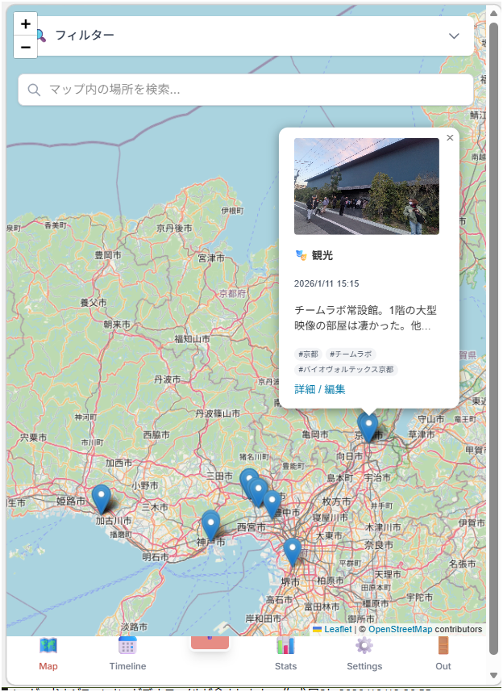
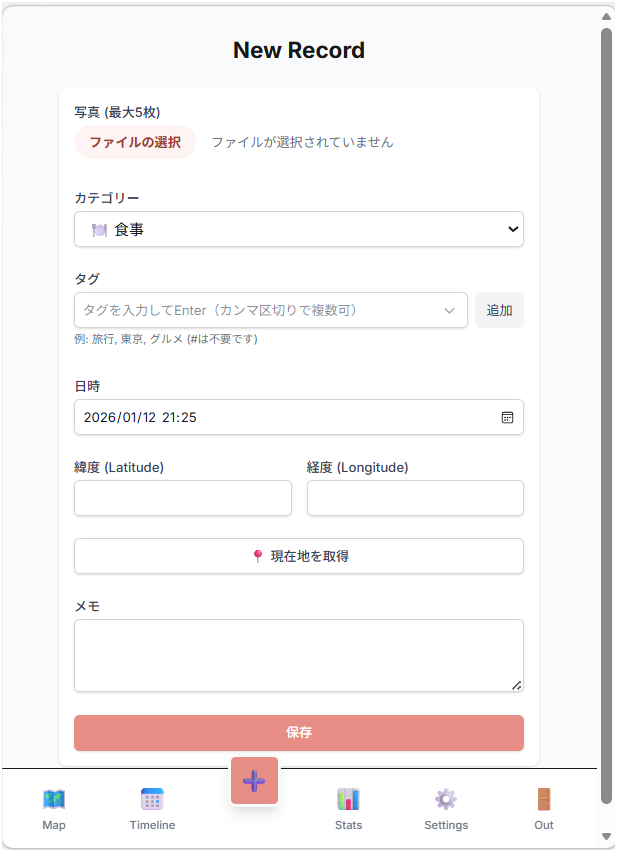
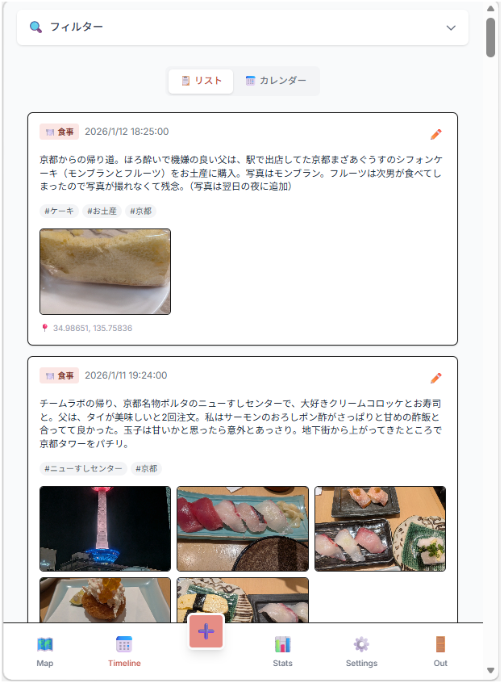
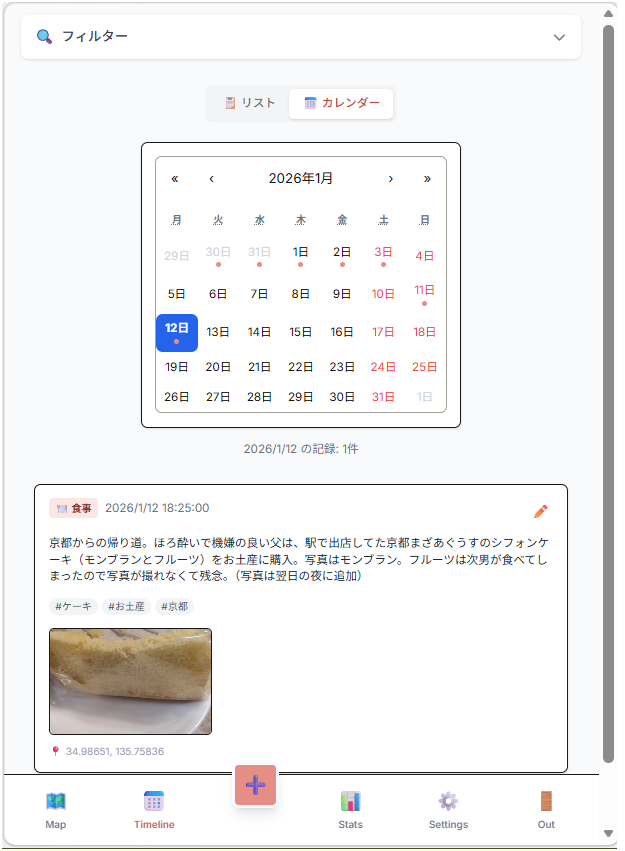
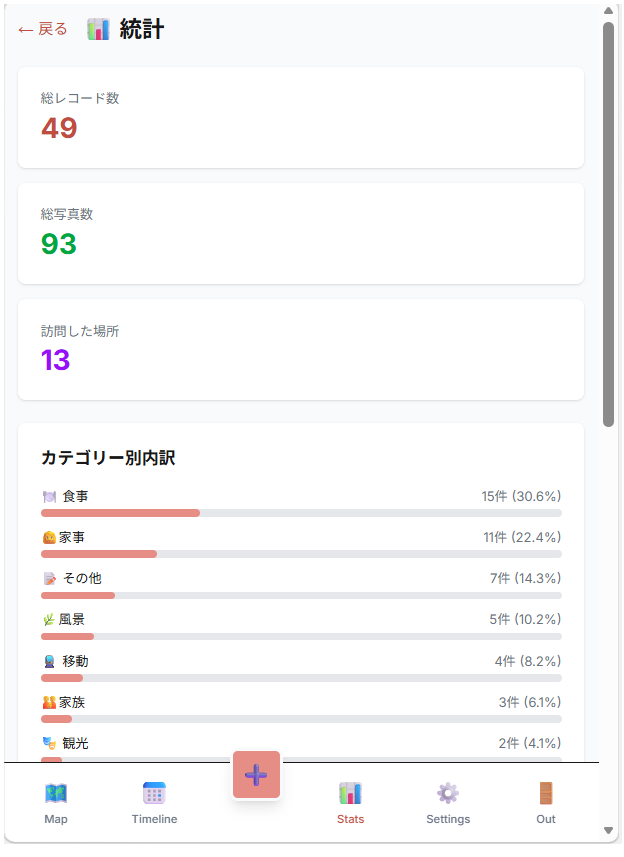
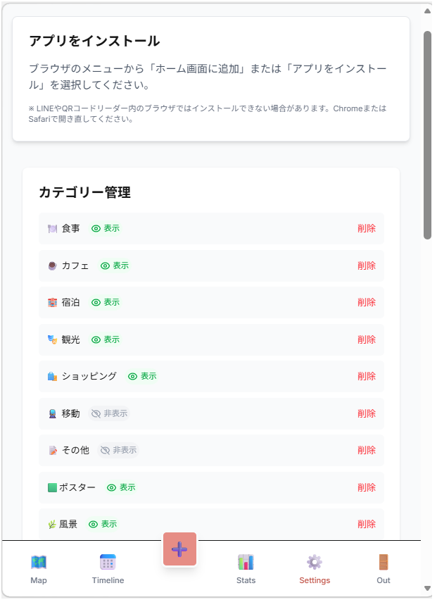
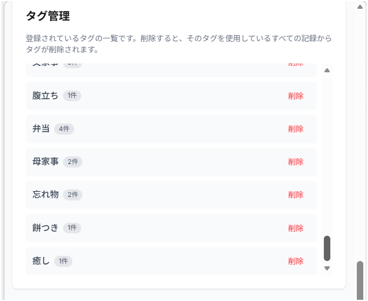

# Footprint App

**自分だけの足跡（フットプリント）を記録する、プライベートなライフログアプリケーション。**

訪れた場所の写真、位置情報、その時の想いを記録し、美しい地図やタイムラインで振り返ることができます。
Googleアカウントによるセキュアな認証と、オフラインでも使えるPWA対応により、いつでもどこでもあなただけの地図を広げられます。



## ✨ 主な機能

### 🗺️ マップビュー (Map View)
足跡を地図上に可視化します。
- **スマートグルーピング**: 近く（約5m以内）で撮影された複数の写真は1つのピンにまとめられ、クリックで快適にめくることができます。GPSの微妙なズレを気にする必要はありません。
- **カテゴリ色分け**: 「食事」「観光」など、カテゴリごとに設定したテーマカラーでピンが表示されます。色は10色のパレットから自由にカスタマイズ可能です。
- **オートフィット**: 表示中の記録に合わせて、地図の縮尺と中心を自動調整します。

### 📝 記録する (Record)
訪れた場所ですぐに記録。
- **写真記録**: 1件につき最大5枚までアップロード可能。サーバー側で最適化され、スムーズに表示されます。
- **自動入力**: 写真のEXIFデータから「撮影日時」と「撮影場所（緯度経度）」を自動抽出します。
- **タグ・カテゴリ**: 独自のタグやカテゴリで記録を整理できます。



### ⏱️ タイムライン & 統計 (Timeline & Stats)
**タイムライン**: 時系列で思い出を振り返ります。リスト表示とカレンダー表示の切り替えが可能です。

| リスト表示 | カレンダー表示 |
|:---:|:---:|
|  |  |

**統計**: 訪れた都道府県の数や、月ごとの記録数などをグラフで可視化し、活動の傾向を分析できます。



### ⚙️ データ管理 & カスタマイズ (Data & Settings)
- **カテゴリ管理**: カテゴリの追加・削除、表示ON/OFF、そして**カラー設定**が可能です。
- **タグ管理**: 不要になったタグを一括削除できます。
- **CSVインポート/エクスポート**: データをCSV形式でバックアップ、または編集して再インポート（更新）が可能です。

| カテゴリ設定 | タグ管理 | データ管理 |
|:---:|:---:|:---:|
|  |  |  |

- **オフライン対応**: 電波の届かない場所でも閲覧・記録が可能（次回オンライン時に自動同期）。

## 🛠️ 技術スタック
- **Frontend**: Next.js 14 (App Router), React, TypeScript, Tailwind CSS
- **Backend**: Firebase (Authentication, Firestore, Storage)
- **Map**: React-Leaflet (OpenStreetMap)
- **PWA**: next-pwa
- **Utilities**: papaparse (CSV), exifr (EXIF extraction), sonner (Toast notifications)

## 🚀 Getting Started

### 必須条件
- Node.js 18+
- Firebase Project (Auth, Firestore, Storage enabled)

### インストール手順

```bash
# リポジトリのクローン
git clone [repository-url]
cd footprint-app

# 依存関係のインストール
npm install

# 環境変数の設定
cp .env.example .env.local
# .env.local にFirebaseの設定値を記述してください
```

### 開発サーバーの起動

```bash
npm run dev
# localhost:3000 で起動します
```

## 🔒 プライバシー
このアプリは「自分用」または「招待制」を想定しており、Google認証によって許可されたユーザーのみがデータにアクセスできます。データはFirestoreセキュリティルールによって厳格に保護されています。

## 📜 開発履歴
詳細な開発の経緯や更新履歴については [PROGRESS.md](PROGRESS.md) をご覧ください。

## 📄 License
[MIT License](LICENSE) © 2025-2026 猫柄毛布 (calico-blanket)
